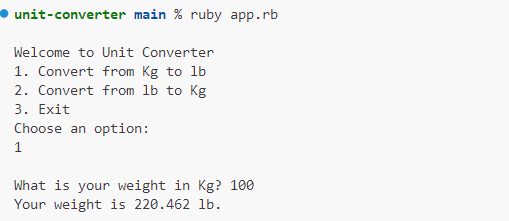
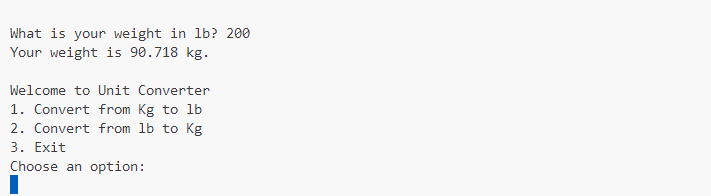
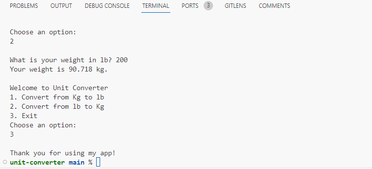
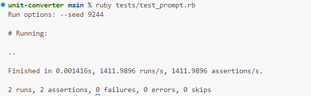

# Unit converter

## Description

Unit converter is a simple CLI app that provide a unit conversion from KG to LB and from LB to KG
## Usage

By creating Unit Converter, my goal is simplify the process of converting weight .I also wanted to implement what i learened from this curricullam.

## how to use it
in your terminal run `ruby app.rb` then choose your prefered option either is it `1` or `2`

## Minitest

Minitest is also available for 2 functions the conversion from LB to KG and the conversion from KG to LB

in your terminal run `ruby tests/test_prompt.rb`

## used Technologies
- Sinatra ,Ruby, Minitest

## Credit
-ask GPT

## github link
https://github.com/melhelow/unit-converter
